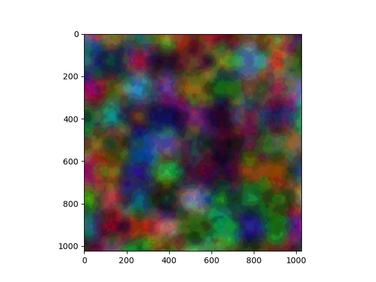

# N Perlin Noise

## active dev @[v0.1.3-alpha_dev](https://github.com/Amith225/nPerlinNoise/tree/v0.1.3-alpha_dev)

### A robust open source implementation of Perlin Noise Algorithm for N-Dimensions in Python.
- A _powerful_ and _fast_ API for _n-dimensional_ noise.
- Easy hyper-parameters selection of _octaves_, _lacunarity_ and _persistence_
  as well as complex and customizable hyper-parameters for n-dimension
  _frequency_, _waveLength_, _warp_(interpolation) and _range_.
- Includes various helpful tools for noise generation and for procedural generation tasks
  such as customizable _Gradient_, _Color Gradients_, _Warp_ classes.
- Implements custom _PRNG_ generator for n-dimension and can be easily tuned.

**Details**:
- **Technology stack**:
  > **Status**: **`v0.1.3-alpha`** Ready for public PyPI release 
  > **All Packages**: [releases](https://github.com/Amith225/NPerlinNoise/releases) 
  > **PyPI**: [v0.1.3a0](https://pypi.org/project/NPerlinNoise/0.1.3a0/) 
  > [CHANGELOG](docs/CHANGELOG.md) 

**Screenshots**:
- raw 
  
- wood 
  
- hot nebula 
  
- island 
  
- land 
  
- marble fractal 
  
- patch 
  
- color patch 
  
- ply1 
  
- ply2 
  
- stripes 
  
- warp 
  

---

## Dependencies
- `Python>=3.10.0`

for production dependencies see [Requirements](requirements.txt) 
for development dependencies see [Dev-Requirements](requirements_dev.txt)

## Installation
for detailed instruction on installation see [INSTALLATION](docs/INSTALL.md).

## Usage
for detailed usage see [EXAMPLE](tests/main.py)

## How to test the software
- To test overalls run [main](tests/main.py)
- To test Logical consistency run [testLogic](tests/testLogic.py)
- To test Profile Benchmarking run [testProfile](tests/testProfile.py)
- To test Visuals run [testVisuals](tests/testVisuals.py)
- To test Colors run [testCol](tests/testCol.py)

to see all tests see [Tests](tests)

## Known issues
- **_`No Known Bugs`_**
- **_`NPerlin.findBounds is bottleneck`_**

## Getting help
- Check [main.py](tests/main.py) for detailed usage
- Check [docs](docs) for all documentations
- Check [Usage](#usage) Section

If you have questions, concerns, bug reports, etc,
please file an [issue](https://github.com/Amith225/NPerlinNoise/issues) in this repository's Issue Tracker or
open a [discussion](https://github.com/Amith225/NPerlinNoise/discussions/7) in this repository's Discussion section.

## Getting involved
- `Looking for Contributors for WebApps`
- [Fork](https://github.com/Amith225/NPerlinNoise/fork) the repository
  and issue a [PR](https://github.com/Amith225/NPerlinNoise/pulls) to contribute

General instructions on _how_ to contribute  [CONTRIBUTING](docs/CONTRIBUTING.md).

----

## Open source licensing info
1. [TERMS](docs/TERMS.md)
2. [LICENSE](LICENSE)
3. [CFPB Source Code Policy](https://github.com/cfpb/source-code-policy/)

----

## Credits and references
1. Inspired from [The Coding Train](https://www.youtube.com/channel/UCvjgXvBlbQiydffZU7m1_aw) -> [perlin noise](https://thecodingtrain.com/challenges/24-perlin-noise-flow-field)
2. hash function by [xxhash](https://github.com/Cyan4973/xxHash)
   inspired the [rand3](src/NPerlinNoise/tools.py) algo
   and ultimately helped for O(1) time complexity n-dimensional random generator [NPrng](src/NPerlinNoise/tools.py)
3. [StackOverflow](https://stackoverflow.com/) for helping on various occasions throughout the development
