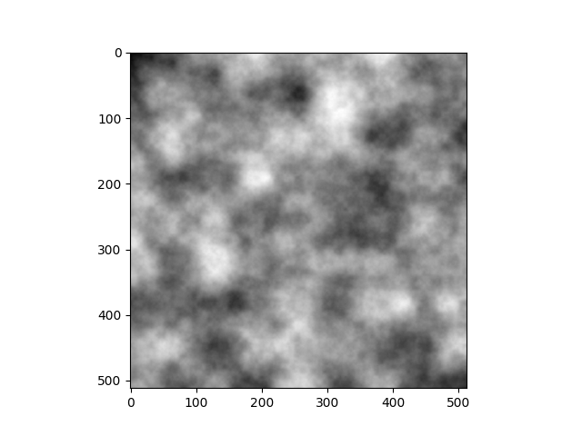
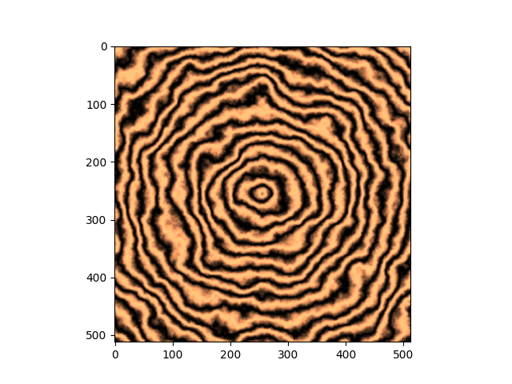
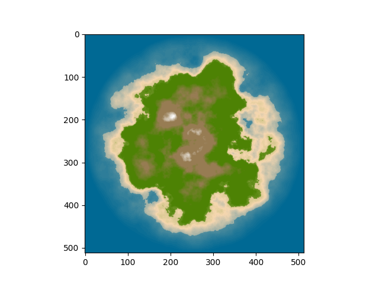
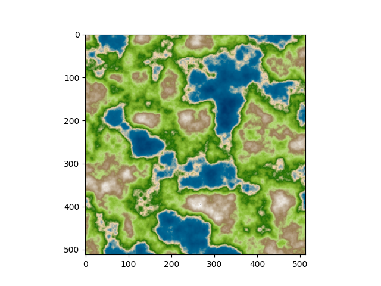
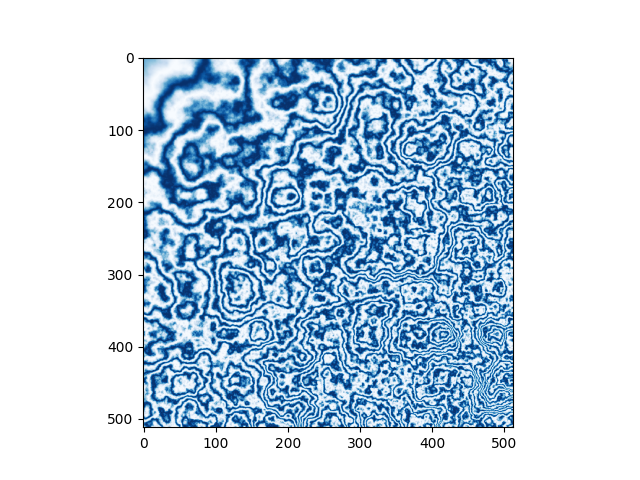
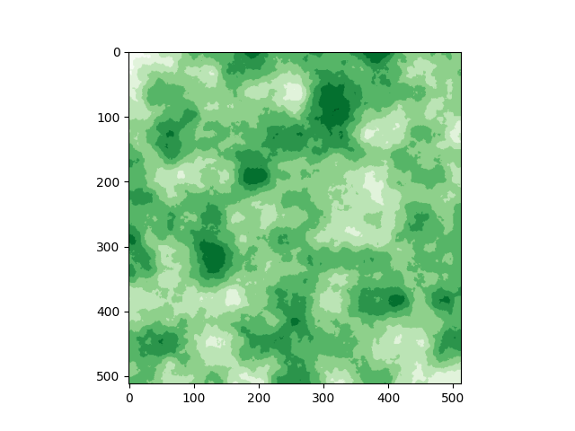
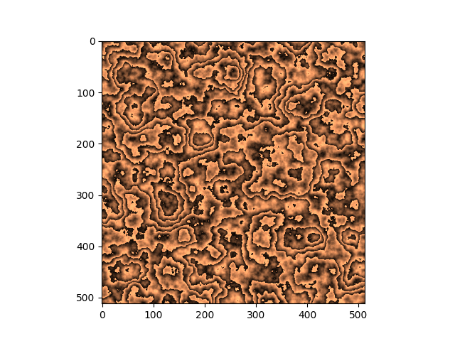
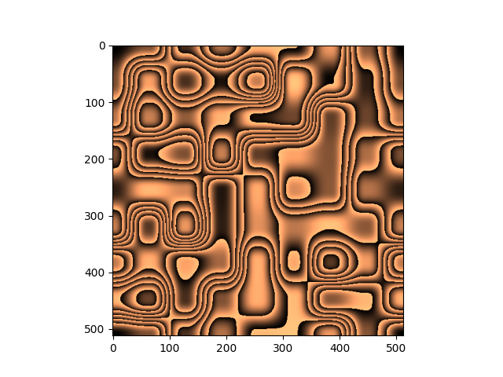
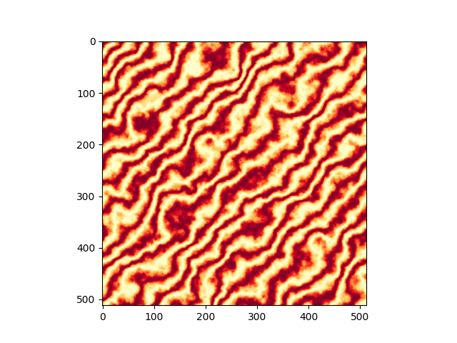
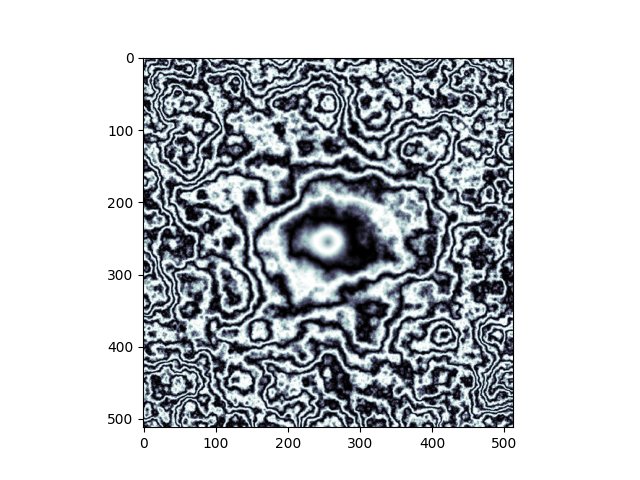

# N Perlin Noise

### A robust open source implementation of Perlin Noise Algorithm for N-Dimensions in Python.
- A powerful and fast API for n-dimensional noise.
- Easy hyper-parameters selection of octaves, lacunarity and persistence
  as well as complex and customizable hyper-parameters for n-dimension
  frequency, waveLength, warp(interpolation) and range.
- Includes various helpful tools for noise generation and for procedural generation tasks
  such as customizable Gradient, Warp classes.
- Implements custom PRNG generator for n-dimension and can be easily tuned.

**Details**:
- **Technology stack**:
- **Status**: [v0.1.0@alpha](https://github.com/Amith225/NPerlinNoise/releases/tag/v0.1.0%40alpha), in documentation and bug fixes stage [CHANGELOG](docs/CHANGELOG.md).
- **[Links]()**
- **Additional Description**

**Screenshots**:
- raw
  - 
- wood
  - 
- hot nebula
  - 
- island
  - 
- island zoom
  - 
- land
  - 
- marble fractal
  - 
- patch
  - 
- ply1
  - 
- ply2
  - 
- stripes
  - 
- warp
  - 

---

## Dependencies
- Python~=3.10.0
- [Requirements](requirements.txt)

## Installation
- [INSTALLATION](docs/INSTALL.md) document.

## Usage
Show users how to use the software.
Be specific.
Use appropriate formatting when showing code snippets.

## How to test the software
If the software includes automated tests, detail how to run those tests.

## Known issues
Document any known significant shortcomings with the software.

## Getting help
Instruct users how to get help with this software; this might include links to an issue tracker, wiki, mailing list, etc.

**Example**
If you have questions, concerns, bug reports, etc, please file an issue in this repository's Issue Tracker.

## Getting involved
This section should detail why people should get involved and describe key areas you are
currently focusing on; e.g., trying to get feedback on features, fixing certain bugs, building
important pieces, etc.

General instructions on _how_ to contribute should be stated with a link to [CONTRIBUTING](docs/CONTRIBUTING.md).

----

## Open source licensing info
1. [TERMS](docs/TERMS.md)
2. [LICENSE](LICENSE)
3. [CFPB Source Code Policy](https://github.com/cfpb/source-code-policy/)

----

## Credits and references
1. Projects that inspired you
2. Related projects
3. Books, papers, talks, or other sources that have meaningful impact or influence on this project
