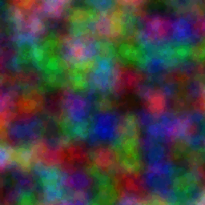
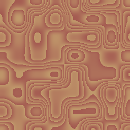
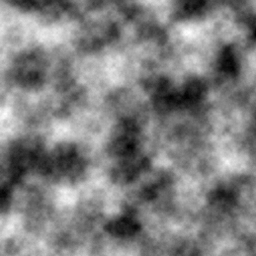
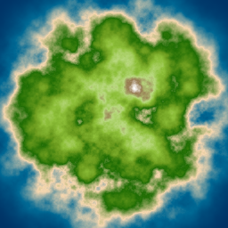
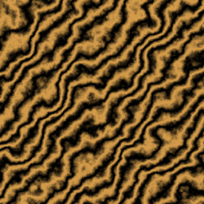
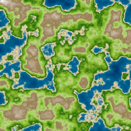

<a href="https://github.com/Amith225/nPerlinNoise/blob/master/LICENSE"></a>
<a href="https://github.com/Amith225/nPerlinNoise"></a>
<a href="https://pypi.org/project/nPerlinNoise"></a>
<a href="https://github.com/Amith225/nPerlinNoise/releases/latest"></a>
<a href="https://github.com/Amith225/nPerlinNoise/releases"></a>
<a href="https://www.python.org/downloads/"></a>
<a href="#"></a>

[](https://forthebadge.com)
[](https://forthebadge.com)
[](https://forthebadge.com)
[](https://forthebadge.com)
[](https://forthebadge.com)

# nPerlinNoise

### A robust open source implementation of Perlin Noise Algorithm for N-Dimensions in Python.
- A _powerful_ and _fast_ API for _n-dimensional_ noise.
- Easy hyper-parameters selection of _octaves_, _lacunarity_ and _persistence_
  as well as complex and customizable hyper-parameters for n-dimension
  _frequency_, _waveLength_, _warp_(interpolation) and _range_.
- Includes various helpful tools for noise generation and for procedural generation tasks
  such as customizable _Gradient_, _Color Gradients_, _Warp_ classes.
- Implements custom _PRNG_ generator for n-dimension and can be easily tuned.

**Details**:
- **Technology stack**:
  > **Status**: **`v0.1.3-alpha`** Improving docs<br>
  > **All Packages**: [releases](https://github.com/Amith225/nPerlinNoise/releases)<br>
  > [CHANGELOG](docs/CHANGELOG.md)<br>
  > ###### _Tested on Python 3.10, Windows 10_
- **Future work**:
  > **optimization** for higher dimensions and single value coordinates<br>

**Screenshots**:











---

## Dependencies
- `Python>=3.10.0`

for production dependencies see [Requirements](requirements.txt)<br>
for development dependencies see [Dev-Requirements](requirements_dev.txt)

## Installation
for detailed instruction on installation see [INSTALLATION](docs/INSTALL.md).

<a id="usage"></a>
## Usage
- ```python
  import nPerlinNoise as nPN
  
  noise = nPN.Noise(seed=69420)

  # get noise values at given n-dimensional coordinates by calling noise with those coords
  # coordinates can be single value, or an iterable
  # noise(..., l, m, n, ...) where l, m, n, ... are single numeric values
  # or
  # noise(...., [l1, l2, ..., lx], [m1, m2, ..., mx], [n1, n2, ..., nx], ....)
  # where .... are iterable of homogeneous-dimensions
  # the output will be of same shape of input homogeneous-dimensions
  
  noise(73)  # 0.5207113
  noise(73, 11, 7)  # 0.5700986
  noise(0, 73, 7, 11, 0, 3)  # 5222712

  noise([73, 49])  # [0.52071124, 0.6402224]
  noise([73, 49], [2, 2])  # [0.4563121 , 0.63378346]
  
  noise([[73], [49], [0]],
        [[2], [2], [2]],
        [[0], [1], [2]])
  # -> [[0.4563121],
  #     [0.6571784],
  #     [0.16369209]]
  
  noise([[1, 2], [2, 3]],
        [[1, 1], [1, 1]],
        [[2, 2], [2, 2]])
  # -> [[0.08666219, 0.09778494],
  #     [0.09778494, 0.14886124]]

  # noise(..., l, m, n, ...) has same values with trailing dimensions having zero as coordinate
  # i.e noise(..., l, m, n) = noise(..., l, m, n, 0) = noise(..., l, m, n, 0, 0) = noise(..., l, m, n, 0, 0, ...)
  noise(73)  # 0.5207113
  noise(73, 0)  # 0.5207113
  noise(73, 0, 0) # 0.5207113
  ```

for detailed usage see [EXAMPLE](tests/main.py)

## How to test the software
- To test overalls run [main](tests/main.py)
- To test Logical consistency run [testLogic](tests/testLogic.py)
- To test Profile Benchmarking run [testProfile](tests/testProfile.py)
- To test Visuals run [testVisuals](tests/testVisuals.py)
- To test Colors run [testCol](tests/testCol.py)

to see all tests see [Tests](tests)

## Known issues
- **_`No Known Bugs`_**
- **_`NPerlin.findBounds is bottleneck`_**
- **_`noise(a, b, c, d, e, f, ...) is slow for single value coordinates`_**

## Getting help
- Check [main.py](tests/main.py) for detailed usage
- Check [docs](docs) for all documentations
- Check [Usage](#usage) Section

If you have questions, concerns, bug reports, etc.
please file an [issue](https://github.com/Amith225/nPerlinNoise/issues) in this repository's Issue Tracker or
open a [discussion](https://github.com/Amith225/nPerlinNoise/discussions/7) in this repository's Discussion section.


## Getting involved
- `Looking for Contributors for WebApps`
- `Looking for Contributors for Documentation`
- `Looking for Contributors for feature additions`
- `Looking for Contributors for optimization`
- [Fork](https://github.com/Amith225/nPerlinNoise/fork) the repository
  and issue a [PR](https://github.com/Amith225/nPerlinNoise/pulls) to contribute

General instructions on _how_ to contribute  [CONTRIBUTING](docs/CONTRIBUTING.md).

----

## Open source licensing info
1. [TERMS](docs/TERMS.md)
2. [LICENSE](LICENSE)
3. [CFPB Source Code Policy](https://github.com/cfpb/source-code-policy/)

----

## Credits and references
1. Inspired from [The Coding Train](https://www.youtube.com/channel/UCvjgXvBlbQiydffZU7m1_aw) -> [perlin noise](https://thecodingtrain.com/challenges/24-perlin-noise-flow-field)
2. hash function by [xxhash](https://github.com/Cyan4973/xxHash)
   inspired the [rand3](src/nPerlinNoise/tools.py) algo
   and ultimately helped for O(1) time complexity n-dimensional random generator [NPrng](src/nPerlinNoise/tools.py)
3. [StackOverflow](https://stackoverflow.com/) for helping on various occasions throughout the development

**Maintainer**:

| <a href="https://github.com/Amith225"></a> |
|:--------------------------------------------------------------------------------------------------------------------------------------------------------------------------------------------------------------------------------------:|
|                                                                                         **[Amith M](https://www.linkedin.com/in/amith-m-17088b246/)**                                                                                          |
|                                                  [](https://instagram.com/amithm3 )                                                   |
